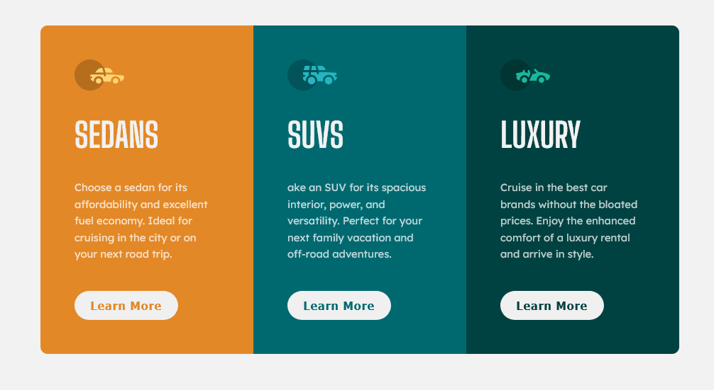
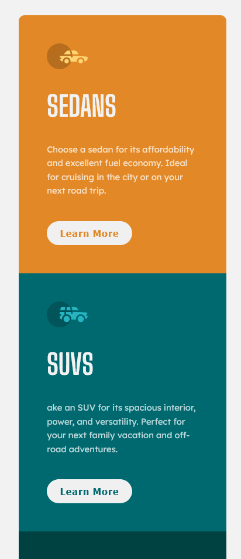

### Links

- Solution URL: [github](https://github.com/sGabunia/3-column-preview-card-component-main)
- Live Site URL: [Go Live](https://boring-kalam-ac6dea.netlify.app/)

## Table of contents

- [Overview](#overview)

  - [The challenge](#the-challenge)
  - [Screenshot](#screenshot)
  - [Links](#links)

- [Author](#author)

## Overview

### Screenshot

## My process

### Built with

- Semantic HTML5 markup
- CSS custom properties
- Flexbox
- Mobile-first workflow

## Author

- Website - [Sergo Gabunia](https://github.com/sGabunia)
- Frontend Mentor - [@paran0ids82](https://www.frontendmentor.io/profile/paran0ids82)
- Twitter - [@sergo_gabunia](https://twitter.com/sergo_gabunia)
